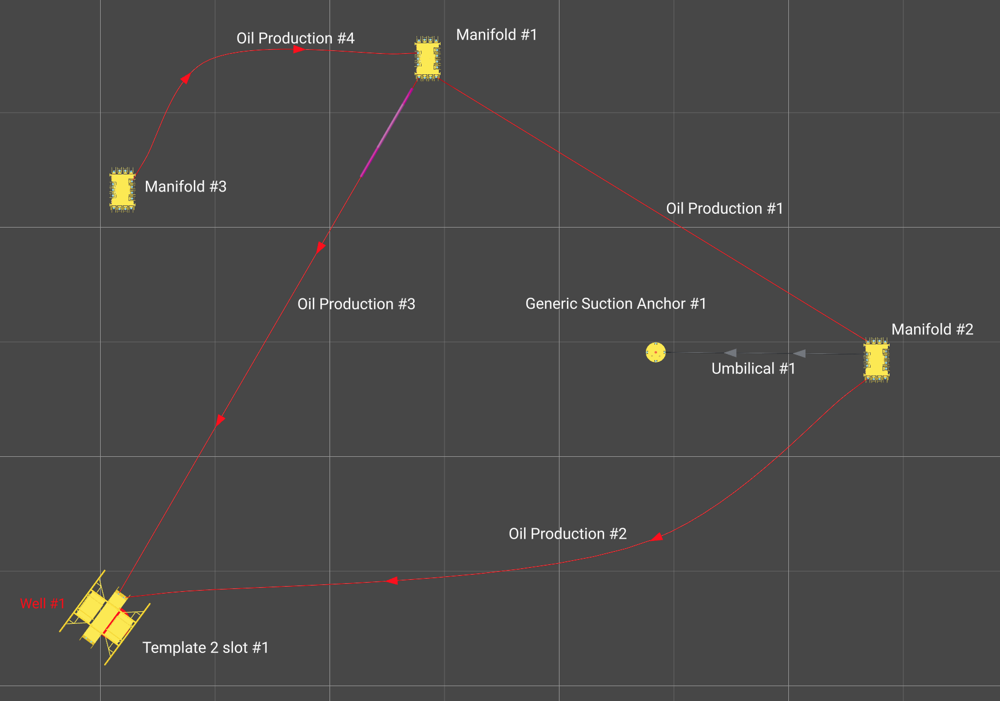

# Graph resolver

When staged assets are joined by connections in FieldTwin, the resulting structure forms a _graph_
(or _network_) of nodes and edges. To travel from one node to another via the connections there may
be zero, one, or multiple possible routes. Some routes may be blocked if an asset does not provide
both an input and output for a connection. Some routes should not be possible if the connection types
are different (for example attempting to follow a _gas_ line into an _oil_ line).

This utility reads a subproject from FieldTwin and provides a list of the possible routes between
two nodes.



Possible routes from _Manifold #3_ to _Template 2 slot #1_:

* `Manifold #3 -> Oil production #4 -> Manifold #1 -> Oil production #3 -> Template 2 slot #1`
* `Manifold #3 -> Oil production #4 -> Manifold #1 -> Oil production #1 -> Manifold #2 -> Oil production #2 -> Template 2 slot #1`

## Notes

* The connection _category_ (rather than _type_) determines whether the next connection is followed
  * This allows one route to contain for example - Oil Jumper, Oil Production, Oil Export - 
    since these 3 different types have the same category
* The direction of connections is ignored, they may be followed in either direction
* Pigging loops are not followed

## Usage

```js
import { findPaths } from '@xvisionas/graph-resolver'

// Provide either an API token OR a JWT
const API_TOKEN = '<YOUR-TOKEN>'
const JWT = ''
const authHeaders = API_TOKEN ? { 'Token': API_TOKEN } : { 'Authorization': `Bearer ${JWT}` }

// This information can be obtained from the JWT if you have one
const backendHostname = 'backend.<EXAMPLE>.fieldtwin.com'
const projectId = '-M-HHqMifhz6qskW2goc'
let subProjectId = '-MWZBqfmyxgQ46p_dlg1'

// Optional branch in FieldTwin 8.1+
const streamId = ''
if (streamId) {
  subProjectId = `${subProjectId}:${streamId}`
}

// Make the API call to load the subproject
const response = await fetch(`https://${backendHostname}/API/v1.10/${projectId}/subProject/${subProjectId}`, {
  method: 'GET',
  headers: authHeaders
})
if (!response.ok) {
  throw new Error(`Failed to load subproject: ${response.status} ${response.statusText}`)
}
const subProject = await response.json()

// Start/End points need to be a valid ID in subProject.stagedAssets or subProject.wells
// Normally these would come from a UI in your integration - maybe the value of a <select> element
// or by listening for the 'select' event sent by FieldTwin and asking the user to click on an object
const startPoint = '-MZCqjqwbDZQ9XTD5I5P'
const endPoint = '-MWymjRPAoVVdClV08ba'

// Category is optional
// If provided it needs to be a valid value in one of subProject.connectionTypes[].category
const connectionCategory = 264

const paths = findPaths(subProject, startPoint, endPoint, connectionCategory)
console.log(`Found ${paths.length} path(s)`)
console.log(JSON.stringify(paths))
```

Example output from `paths`, containing 2 paths:

```json
[
  [
    {
      "id": "-MZCqjqwbDZQ9XTD5I5P",
      "name": "Manifold #3",
      "type": "stagedAsset",
      "isForeign": false,
      "projectId": "-M-HHqMifhz6qskW2goc",
      "subProjectId": "-MWZBqfmyxgQ46p_dlg1",
      "streamId": "-MWZBqfmyxgQ46p_dlg1"
    },
    {
      "id": "-MZCqmEqvokERuFWlVoT",
      "name": "Oil Production #4",
      "type": "connection",
      "isForeign": false,
      "projectId": "-M-HHqMifhz6qskW2goc",
      "subProjectId": "-MWZBqfmyxgQ46p_dlg1",
      "streamId": "-MWZBqfmyxgQ46p_dlg1"
    },
    {
      "id": "-MWxVs0DTt3wspEFwKhR",
      "name": "Manifold #1",
      "type": "stagedAsset",
      "isForeign": false,
      "projectId": "-M-HHqMifhz6qskW2goc",
      "subProjectId": "-MWZBqfmyxgQ46p_dlg1",
      "streamId": "-MWZBqfmyxgQ46p_dlg1"
    },
    {
      "id": "-MWxVuRkprTblYFOExDD",
      "name": "Oil Production #3",
      "type": "connection",
      "isForeign": false,
      "projectId": "-M-HHqMifhz6qskW2goc",
      "subProjectId": "-MWZBqfmyxgQ46p_dlg1",
      "streamId": "-MWZBqfmyxgQ46p_dlg1"
    },
    {
      "id": "-MWymjRPAoVVdClV08ba",
      "name": "Template 2 slot #1",
      "type": "stagedAsset",
      "isForeign": false,
      "projectId": "-M-HHqMifhz6qskW2goc",
      "subProjectId": "-MWZBqfmyxgQ46p_dlg1",
      "streamId": "-MWZBqfmyxgQ46p_dlg1"
    }
  ],
  [
    {
      "id": "-MZCqjqwbDZQ9XTD5I5P",
      "name": "Manifold #3",
      "type": "stagedAsset",
      "isForeign": false,
      "projectId": "-M-HHqMifhz6qskW2goc",
      "subProjectId": "-MWZBqfmyxgQ46p_dlg1",
      "streamId": "-MWZBqfmyxgQ46p_dlg1"
    },
    {
      "id": "-MZCqmEqvokERuFWlVoT",
      "name": "Oil Production #4",
      "type": "connection",
      "isForeign": false,
      "projectId": "-M-HHqMifhz6qskW2goc",
      "subProjectId": "-MWZBqfmyxgQ46p_dlg1",
      "streamId": "-MWZBqfmyxgQ46p_dlg1"
    },
    {
      "id": "-MWxVs0DTt3wspEFwKhR",
      "name": "Manifold #1",
      "type": "stagedAsset",
      "isForeign": false,
      "projectId": "-M-HHqMifhz6qskW2goc",
      "subProjectId": "-MWZBqfmyxgQ46p_dlg1",
      "streamId": "-MWZBqfmyxgQ46p_dlg1"
    },
    {
      "id": "-MWyKjpDMPqwZRQNNX4K",
      "name": "Oil Production #1",
      "type": "connection",
      "isForeign": false,
      "projectId": "-M-HHqMifhz6qskW2goc",
      "subProjectId": "-MWZBqfmyxgQ46p_dlg1",
      "streamId": "-MWZBqfmyxgQ46p_dlg1"
    },
    {
      "id": "-MWxjGBz5Hplf8Ku2Ppv",
      "name": "Manifold #2",
      "type": "stagedAsset",
      "isForeign": false,
      "projectId": "-M-HHqMifhz6qskW2goc",
      "subProjectId": "-MWZBqfmyxgQ46p_dlg1",
      "streamId": "-MWZBqfmyxgQ46p_dlg1"
    },
    {
      "id": "-MWxkTTazFAtqh9tG7dq",
      "name": "Oil Production #2",
      "type": "connection",
      "isForeign": false,
      "projectId": "-M-HHqMifhz6qskW2goc",
      "subProjectId": "-MWZBqfmyxgQ46p_dlg1",
      "streamId": "-MWZBqfmyxgQ46p_dlg1"
    },
    {
      "id": "-MWymjRPAoVVdClV08ba",
      "name": "Template 2 slot #1",
      "type": "stagedAsset",
      "isForeign": false,
      "projectId": "-M-HHqMifhz6qskW2goc",
      "subProjectId": "-MWZBqfmyxgQ46p_dlg1",
      "streamId": "-MWZBqfmyxgQ46p_dlg1"
    }
  ]
]
```

* In each path found the first entry matches `startPoint` and the last entry matches `endPoint`
* When `isForeign` is `true` this indicates that the object has been brought in from a linked
  parent project (either a local parent or a remote parent if FieldTwin Collaborate is in use)
  * In this case the item's `projectId` and `subProjectId` and `streamId` will be different
    from the subproject that was originally requested
